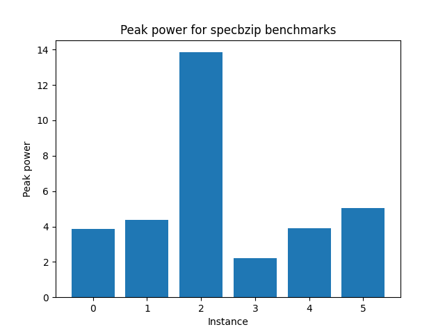

# Advanced-Computer-Architecture-Lab-3

Results collected by McPAT running on VirtualBox VM Ubuntu 19.10.
 
 
### Step 1: McPAT framework basics

#### Question 1:

As explained [here](https://semiengineering.com/knowledge_centers/low-power/low-power-design/power-consumption/):


Total Power = P<sub>switching</sub> + P<sub>short-circuit</sub> + P<sub>leakage</sub>

Dynamic power is the sum of two factors: switching power plus short-circuit power. Switching power is dissipated when charging or discharging internal and net capacitances. Short-circuit power is the power dissipated by an instantaneous short-circuit connection between the supply voltage and the ground at the time the gate switches state.

Leakage power is a function of the supply voltage, the switching threshold voltage, and the transistor size. Of the following leakage components, sub-threshold leakage is dominant:
* I1: Diode reverse bias current
* I2: Sub-threshold current
* I3: Gate-induced drain leakage
* I4: Gate oxide leakage

While dynamic power is dissipated only when switching, leakage power due to leakage current is continuous.

#### Question 2:

The 40 W processor could run a given program in less time than its 4 W counterpart, which would mean that, overall, the system would require less energy (assuming there are other components that consume power). In addition, if the 40 W processor has lower leakage power consumption, that would make it a more efficient choice. McPAT provides us with the total, dynamic, and leakage power, which could show us which processor is better (through the leakage/total power ratio).

#### Question 3:

From [resultsARM_A9.txt](https://github.com/TheSolipsist/Advanced-Computer-Architecture-Lab-3/blob/main/resultsARM_A9.txt) and [resultsXEON.txt](https://github.com/TheSolipsist/Advanced-Computer-Architecture-Lab-3/blob/main/resultsXEON.txt):

| Power        | ARM_A9  |  XEON   |
| :----------: | :-----: | :-----: |
| Total (Peak) | 1.74189 | 134.938 |
| Leakage      | 0.108687| 36.8319 |

If the ```ARM_A9``` processor took 40 seconds to run a given program, it would consume energy equal to ```40 * 1.74189 = 69.6756 J```, while the ```XEON``` processor, which would run the same program in 1 second, would consume ```134.938 J```. In addition to that, if we don't shut the system down after running the program, power leakage would continue. The ```ARM_A9``` processor has ```0.108687 W``` leakage power, while the ```XEON``` processor has ```36.8319``` leakage power. So, the ```ARM_A9``` processor is more energy efficient, since it consumes less energy and has lower leakage power.

### Step 2: gem5 & McPAT: EDP optimization

#### Question 1:

We ran the ```GEM5ToMcPAT.py``` and ```print_energy.py``` scripts for each benchmark and got the required [results](https://github.com/TheSolipsist/Advanced-Computer-Architecture-Lab-3/tree/main/print_energy_results).

#### Question 2:

From our [previous lab exercise](https://github.com/TheSolipsist/Advanced-Computer-Architecture-Lab-2):

`specbzip`:

| Instance | l1d_size | l1i_size | l2_size | l1i_assoc | l1d_assoc | l2_assoc | cacheline_size |
| :------: | :------: | :------: | :-----: | :-------: | :-------: | :------: | :------------: |
|  			0 		 |  			32 		|  			64 		|  	1024  |  			1 		  |  			1 		  |  			2 		 |   	 		64 		    |
|  			1 		 |  			32 		|  			64 		|  	512 		|  			8 		  |  			8 		  |  			16 	 |   	 		64 		    |
|  			2 		 |  			64 		|  			128 	|  	2048  |  			64 		 |  			64 		 |  			64   |   	 		64 		    |
|  			3 		 |  			32 		|  			64 		|  	1024	 |  			2 		  |  			2 		  |  			8    |   	 		64 		    |
|  			4 		 |  			64 		|  			32 		|  	1024 	|  			4 		  |  			4 		  |  			16   |   	 		64 		    |
|  			5 		 |  			64 		|  			128  |  	4096 	|  			4 		  |  			4 		  |  			1    |  	  		64 		    |

`spechmmer`:

| Instance | l1d_size | l1i_size | l2_size | l1i_assoc | l1d_assoc | l2_assoc | cacheline_size |
| :------: | :------: | :------: | :-----: | :-------: | :-------: | :------: | :------------: |
|  			0 		 |  			32 		|  			64 		|   512   |  			1 		  |  			1 		  |  			2 		 |  			  64 		    |
|  			1 		 |  			64 	 |  			64 	 |  	512   |  			2 		  |  			2 		  |  			4    |  	  		64 		    |
|  			2 		 |  			64 		|  			128 	|  	2048  |  			2 		  |  			2 		  |  			8 	  |    			64 		    |
|  			3 		 |  			128 	|  			128  |  	2048  |  			4 		  |  			4 		  |  			8    |    			64 		    |
|  			4 		 |  			64 	 |  			128  |  	2048  |  			16 		 |  			16 	  |  			32   |    			64 		    |
|  			5 		 |  			128  |  			128 	|  	4096  |  			16 	  |  			16    |  			32   |    			64 	     |

`speclibm`:

| Instance | l1d_size | l1i_size | l2_size | l1i_assoc | l1d_assoc | l2_assoc | cacheline_size |
| :------: | :------: | :------: | :-----: | :-------: | :-------: | :------: | :------------: |
|  			0 		 |  			32 		|  			64 		|  	1024  |  			32 		 |  			32 		 |  			64 		|  			  64 		    |
|  			1 		 |  			32 	 |  			64 	 |  	512 		|  			2 		  |  			2 		  |  			8 		 |  		  	64 		    |
|  			2 		 |  			64   |  			128  |  	2048 	|  			2 		  |  			2 		  |  			8 		 |  	  		64 		    |
|  			3 		 |  			128  |  			128  |  	1024		|  			2 		  |  			2 		  |  			8 		 |  	   	64 		    |
|  			4 		 |  			32   |  			64 	 |  	512 		|  			16 		 |  			16 		 |  			32 		|  		  	64 		    |
|  			5 		 |  			64   |  			128  |  	4096 	|  			16 		 |  			16 		 |  			32 		|  		  	64 		    |

`specmcf`:

| Instance | l1d_size | l1i_size | l2_size | l1i_assoc | l1d_assoc | l2_assoc | cacheline_size |
| :------: | :------: | :------: | :-----: | :-------: | :-------: | :------: | :------------: |
|    0     |    32    |    64    |   512   |     4     |     4     |     8    |       64       |
|    1     |    128   |    128   |   2048  |     8     |     8     |     16   |       64       |
|    2     |    32    |    32    |   512   |     2     |     2     |     4    |       64       |
|    3     |    32    |    64    |   512   |     4     |     4     |     8    |       64       |
|    4     |    128   |    128   |   2048  |     8     |     8     |     16   |       64       |
|    5     |    32    |    32    |   512   |     2     |     2     |     4    |       64       |

`specsjeng`:

| Instance | l1d_size | l1i_size | l2_size | l1i_assoc | l1d_assoc | l2_assoc | cacheline_size |
| :------: | :------: | :------: | :-----: | :-------: | :-------: | :------: | :------------: |
|  			0 		 |  			32 	 |  		64 	  |   512   |  			1 		  |  			1 		  |  			2    |  			  64	      |
|  			1 		 |  			64   |  		64 	  |   1024  |  			2 		  |  			2 		  |  			8 		 |  			  64	      |
|  			2 		 |  			64   | 			128   | 	 2048  |  			4 		  |  			4 		  |  			16   |  			  64       |
|  			3 		 |  			128  | 			128   | 	 1024 	|  			2 		  |  			2 		  |  			8 	  |  			  64	      |
|  			4 		 |  			64 	 | 			128   | 	 2048 	|  			16 		 |  			16 		 |  			32   |  			  64	      |
|  			5 		 |  			128  |  		128  	| 	 4096 	|  			16 		 |  			16 		 |  			32 	 |  			  64 	     |

The following graphs show the EDP for each benchmark:

```specbzip```:



```spechmmer```:


```speclibm```:


```specmcf```:


```specsjeng```:


